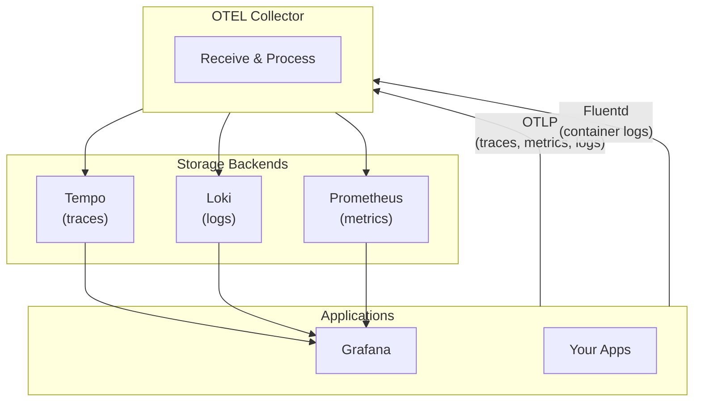

# MLT Stack - Metrics, Logs & Traces

A complete observability stack for learning and development using Docker Compose.

## 🏗️ Architecture



## 📦 Components

| Component | Port | Description |
|-----------|------|-------------|
| **Grafana** | 3000 | Visualization & dashboards |
| **Tempo** | 3200 | Distributed tracing backend |
| **Loki** | 3100 | Log aggregation system |
| **Prometheus** | 9090 | Metrics database |
| **OTEL Collector** | 4317, 4318 | Telemetry data pipeline |
| **Grafana MCP** | 8001 | AI-driven Grafana interactions |

## 🚀 Quick Start

### Start the stack
```bash
./start.sh
# or
docker compose up -d
```

### Stop the stack
```bash
docker compose down
```

### View logs
```bash
docker compose logs -f           # All services
docker compose logs -f grafana   # Specific service
```

## 🔐 Access

### Grafana
- **URL:** http://localhost:3000
- **Username:** `mltadmin`
- **Password:** `mltpassword`

### Other UIs
- **Prometheus:** http://localhost:9090
- **Tempo:** http://localhost:3200

## 📡 Sending Telemetry Data

### OTLP Endpoints (for your applications)

| Protocol | Endpoint |
|----------|----------|
| gRPC | `localhost:4317` |
| HTTP | `localhost:4318` |

### Example: Send traces from your app

**Python (opentelemetry-sdk):**
```python
from opentelemetry import trace
from opentelemetry.exporter.otlp.proto.grpc.trace_exporter import OTLPSpanExporter
from opentelemetry.sdk.trace import TracerProvider
from opentelemetry.sdk.trace.export import BatchSpanProcessor

# Configure exporter
exporter = OTLPSpanExporter(endpoint="localhost:4317", insecure=True)
provider = TracerProvider()
provider.add_span_processor(BatchSpanProcessor(exporter))
trace.set_tracer_provider(provider)
```

**Environment variables (for any OTLP-compatible app):**
```bash
OTEL_EXPORTER_OTLP_ENDPOINT=http://localhost:4318
OTEL_SERVICE_NAME=my-app
```

## 🔍 Exploring Data in Grafana

### Traces (Tempo)
1. Go to **Explore** → Select **Tempo**
2. Search by:
   - **Service name:** `{resource.service.name="grafana"}`
   - **Trace ID:** Paste a trace ID directly

### Logs (Loki)
1. Go to **Explore** → Select **Loki**
2. Example queries:
   - All logs: `{}`
   - By container: `{container="grafana"}`
   - Search text: `{} |= "error"`

### Metrics (Prometheus)
1. Go to **Explore** → Select **Prometheus**
2. Example queries:
   - `up` - Which services are up
   - `process_cpu_seconds_total` - CPU usage

## 📁 Directory Structure

```
mlt-stack/
├── docker-compose.yaml      # Main compose file
├── start.sh                 # Startup script
├── grafana/
│   ├── Dockerfile
│   ├── grafana.ini          # Grafana configuration
│   ├── dashboard-jsons/     # Pre-built dashboards
│   └── provisioning/
│       ├── datasources/     # Auto-configured datasources
│       └── dashboards/      # Dashboard provisioning
├── tempo/
│   └── tempo.yaml           # Tempo configuration
├── loki/
│   └── loki.yaml            # Loki configuration
├── prometheus/
│   └── prometheus.yml       # Prometheus configuration
└── otel-collector/
    └── otel-collector.yaml  # OTEL Collector configuration
```

## 🔧 Configuration

### Grafana Tracing
Grafana is pre-configured to send its own traces to the OTEL Collector. See `grafana/grafana.ini`:
```ini
[tracing.opentelemetry.otlp]
address = otel-collector:4317
```

### Container Logs
Containers can be configured to send logs via fluentd driver:
```yaml
logging:
  driver: fluentd
  options:
    fluentd-address: "host.docker.internal:24224"
    tag: "my-service"
```

## 🛠️ Troubleshooting

### Check service health
```bash
docker compose ps
```

### Service not starting?
```bash
docker compose logs <service-name>
```

### No data in Grafana?
1. Verify OTEL Collector is running: `docker compose logs otel-collector`
2. Check connectivity: `curl http://localhost:3200/ready` (Tempo)
3. Check Loki: `curl http://localhost:3100/ready`

### Reset everything
```bash
docker compose down -v  # Removes volumes too
docker compose up -d
```

## 📚 Learn More

- [OpenTelemetry](https://opentelemetry.io/)
- [Grafana Tempo](https://grafana.com/docs/tempo/latest/)
- [Grafana Loki](https://grafana.com/docs/loki/latest/)
- [Prometheus](https://prometheus.io/docs/)
